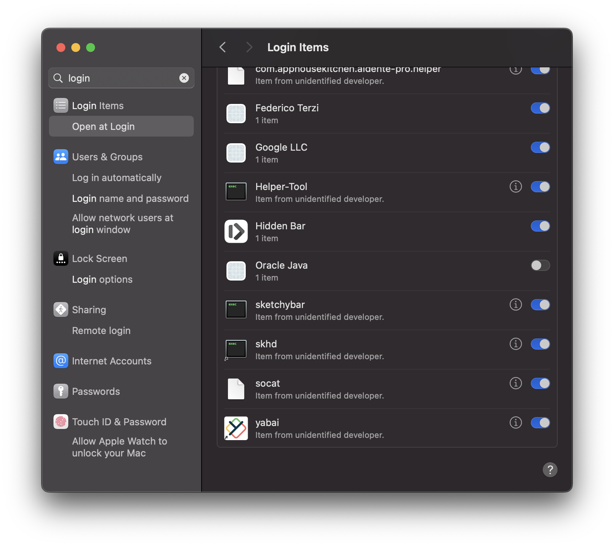

# Installation

1. Follow the Ollama installation instructions
2. Install all the required models: `bash install_models.sh`
3. Ensure the model runs as a systemd / login item for mac & linux

## Adding the port to your port-forwarding of your router.
1. Follow a tutorial on how to get a persistent internal ip for your computer

** NOTE IF YOU ARE ON MAC ** - The following step won't work for you, hence I am giving you a custom launchctl service in order to actually expose your port. As you will run into issues when trying to use the `11434` port. Check out the [MACOS CONTINUATION](#macos-continuation) section

2. Follow a tutorial on how to expose the port. llama uses `11434` as their port to make requests.
3. I would advice to setup a duckdns daemon on your computer & use that instead of your ip address, because most isp's rotates your ip once-in-a-while.

### Macos Continuation 
If you are running on mac you might run into issues when following all the steps and trying to use the model using your ip addr / curling following the official ollama docs.
So you can run the `macos_port.sh` script to effectively open a port on port 2228 (You can change this). And then expose that port instead. Macos will ask you if you want the application to recieve incoming traffic, just press allow.

After that you will need to set the script as a launchctl service by doing:
1. copy the daemon.plist file into the correct directory:
`cp daemon.plist /Library/LaunchDaemons/com.example.socat.plist`
2. Start the Job:
`sudo launchctl load /Library/LaunchDaemons/com.example.socat.plist`
3. Ensure the job works by restaring your computer & checking the login items:

